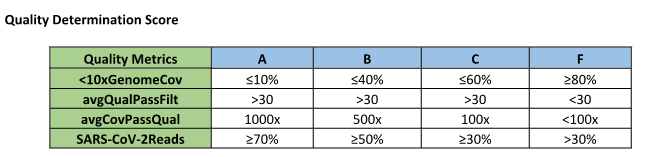

```{r setup, include=FALSE}
knitr::opts_chunk$set(
  echo    = TRUE,
  warning = FALSE,
  message = FALSE,
  fig.width  = 10,
  fig.height = 6
)
```

------------------------------------------------------------------------

## 1. Load Libraries

```{r libraries}
library(readxl)
library(dplyr)
library(ggplot2)
library(tidyr)
library(DBI)
library(odbc)
library(keyring)
library(purrr)
library(writexl)
```

------------------------------------------------------------------------

## 2. Connect to LIMS and Pull Data

```{r lims-connect}
con <- dbConnect(
  odbc(),
  Driver                = "ODBC Driver 18 for SQL Server",
  Server                = "DOH01DBTUMP22,9799",
  Database              = "LIMS_DATA",
  TrustServerCertificate = "Yes",
  Trusted_Connection    = "Yes"
)

lims_data <- dbGetQuery(
  con,
  "SELECT * FROM [vz_Epi_ELS_Multiplex_SARS-Flu-RSV-Mpox_dPCR]"
)
```

------------------------------------------------------------------------

## 3. Import and Combine Run Stats Excel File

```{r import-excel}
# Set file path (update as needed)
file_path <- "/mnt/c/Users/qxy0303/scratch/WAWBE_outcome_analysis/Run Stats.xlsx"

# Read all sheets and append with sheet name as IC_Group
sheets <- excel_sheets(file_path)

df <- lapply(sheets, function(sheet_name) {
  read_excel(file_path, sheet = sheet_name) %>%
    mutate(IC_Group = sheet_name)
}) %>%
  bind_rows()
```

------------------------------------------------------------------------

## 4. Clean and Merge Data

```{r clean-merge}
# Rename columns
colnames(df)[colnames(df) == "Key_ID"]        <- "PHLAccessionNumber"
colnames(df)[colnames(df) == ">10X Coverage"] <- "Coverage_10X"

# Merge WWTP names from LIMS
df <- merge(
  df,
  lims_data[, c("PHLAccessionNumber", "WWTPName")],
  by = "PHLAccessionNumber"
)

# Drop unneeded columns
df <- df %>%
  select(-all_of(c(
    "0x Coverage",
    "...10",
    "...11",
    "#A",
    "#B",
    "#A/B",
    "#C",
    "% Failed",
    "% PASS (A)",
    "% PASS (A/B)",
    "Column1",
    "Library Prep Input Copies"
  )))

# Remove all-NA rows and the validation table sheet
df <- df %>%
  filter(
    rowSums(is.na(.)) != ncol(.),
    IC_Group != "Val Table"
  )

# Duplicated rows after merging, remove dups by WA# - QY
df <- df[!duplicated(df), ]


glimpse(df)
```

------------------------------------------------------------------------

## 5. Correlation: Input Copies vs. \>10X Coverage

```{r correlation}
cor_result <- cor.test(
  df$`Input Copies`,
  df$Coverage_10X,
  method = "pearson"
)

cor_result
```

> **Pearson r = `r round(cor_result$estimate, 3)`**, p = `r signif(cor_result$p.value, 3)`

### Scatter Plot

```{r scatter-plot}
ggplot(df, aes(x = `Input Copies`, y = Coverage_10X)) +
  geom_point(alpha = 0.6) +
  geom_hline(yintercept = 90, color = "red", linewidth = 1.5) +
  scale_x_continuous(limits = c(0, 200)) +
  scale_y_continuous(breaks = c(0, 25, 50, 75, 90, 100)) +
  labs(
    title = "Correlation Between Concentration and >10X Coverage",
    x     = "Number of Input Copies",
    y     = "Samples with >10X Coverage"
  ) +
  theme_minimal()
```

------------------------------------------------------------------------

## 6. WWTP-Level Boxplots

```{r wwtp-label-fn}
# Shared label-cleaning function for WWTP names
clean_wwtp <- function(x) {
  gsub(
    "WWTP|Water|Reclamation|Facility|Treatment|Plant|Wastewater|WRP|Clean|\\(SCTP\\)|Influent|Regional|and|Sewage",
    "", x
  )
}
```

### Input Copies by WWTP

```{r boxplot-input-copies}
ggplot(df, aes(x = WWTPName, y = `Input Copies`, fill = WWTPName)) +
  geom_boxplot() +
  scale_y_continuous(limits = c(0, 200)) +
  scale_x_discrete(labels = clean_wwtp) +
  labs(title = "Input Copies by WWTP", x = NULL, y = "Input Copies") +
  theme_minimal() +
  theme(
    axis.text.x  = element_text(angle = 45, hjust = 1, size = 10),
    legend.position = "none"
  )
```

### Samples with \>10X Coverage by WWTP

```{r boxplot-10x-coverage}
ggplot(df, aes(x = WWTPName, y = Coverage_10X, fill = WWTPName)) +
  geom_boxplot() +
  scale_x_discrete(labels = clean_wwtp) +
  labs(title = "Samples with >10X Coverage by WWTP", x = NULL, y = ">10X Coverage (%)") +
  theme_minimal() +
  theme(
    axis.text.x  = element_text(angle = 45, hjust = 1, size = 10),
    legend.position = "none"
  )
```

------------------------------------------------------------------------

## 7. Quality Summary Table by WWTP



```{r quality-summary}
quality_summary <- df %>%
  mutate(
    Quality = case_when(
      Coverage_10X >= 90                          ~ "A",
      Coverage_10X >= 60 & Coverage_10X < 90      ~ "B",
      Coverage_10X < 60                           ~ "Fail",
      TRUE                                        ~ NA_character_
    )
  ) %>%
  group_by(WWTPName) %>%
  summarise(
    Total_Samples    = n(),
    Percent_A        = round(mean(Quality == "A",    na.rm = TRUE) * 100, 1),
    Percent_B        = round(mean(Quality == "B",    na.rm = TRUE) * 100, 1),
    Percent_Fail     = round(mean(Quality == "Fail", na.rm = TRUE) * 100, 1),
    Avg_Input_Copies = round(mean(`Input Copies`,    na.rm = TRUE), 2)
  ) %>%
  arrange(desc(Percent_A))

quality_summary
```

```{r write-quality-summary, eval=FALSE}
# Export (run manually as needed)
write.csv(quality_summary, file = "WWTP_by_Sample_Quality.csv", row.names = FALSE)
write_xlsx(quality_summary, "quality_summary.xlsx")
```

------------------------------------------------------------------------

## 8. IC Group × QCD Pivot Table

```{r ic-group-pivot}
df2 <- df %>%
  filter(!is.na(QCD)) %>%
  mutate(
    IC_Group = case_when(
      `Input Copies` >= 0   & `Input Copies` <= 4.9    ~ "IC 0-4",
      `Input Copies` >= 5   & `Input Copies` <= 9.9    ~ "IC 5-9",
      `Input Copies` >= 10  & `Input Copies` <= 19.9   ~ "IC 10-19",
      `Input Copies` >= 20  & `Input Copies` <= 29.9   ~ "IC 20-29",
      `Input Copies` >= 30  & `Input Copies` <= 39.9   ~ "IC 30-39",
      `Input Copies` >= 40  & `Input Copies` <= 49.9   ~ "IC 40-49",
      `Input Copies` >= 50  & `Input Copies` <= 100.9  ~ "IC 50-100",
      `Input Copies` >= 101 & `Input Copies` <= 1000   ~ "IC 101-1000",
      TRUE                                             ~ "Other"
    )
  )

IC_Group_Table <- df2 %>%
  group_by(WWTPName, IC_Group, QCD) %>%
  summarise(n = n(), .groups = "drop") %>%
  pivot_wider(
    names_from  = c(IC_Group, QCD),
    values_from = n,
    values_fill = 0
  )

IC_Group_Table
```

```{r write-ic-group, eval=FALSE}
# Export (run manually as needed)
write.csv(df2, "WWTP_QCD_Data_2.csv", row.names = FALSE)
```

## 9.  Multiple Linear Regression

```{r MLR}
library(ggcorrplot)

# Convert categorical data to numeric
df$WWTPName <- as.numeric(as.factor(df$WWTPName))

# Focus on only sample with low input copies
reduced_data <- subset(df, `Input Copies`<=40)

# Remove the irrelevant columns
reduced_data <- subset(reduced_data, select = -c( PHLAccessionNumber, QCD, IC_Group))

# Compute correlation between variables
corr_matrix = cor(reduced_data, use = "pairwise.complete.obs")

# Compute and show the  result
ggcorrplot(corr_matrix, hc.order = TRUE, type = "lower", lab = TRUE)
```

Refine model by removing inter-correlating variables, then construct the linear model

```{r}
# Fit a multiple linear regression model
cov10x_model = lm(formula = Coverage_10X ~ 
                    `Input Copies` + 
                    Library_Concetration + 
                    `Total Reads` + 
                    Coverage + 
                    WWTPName,
                  data = reduced_data)

# Plot the model residuals to ensure normality of residual distribution
hist(cov10x_model$residuals)
```

```{r}
summary(cov10x_model)
```
