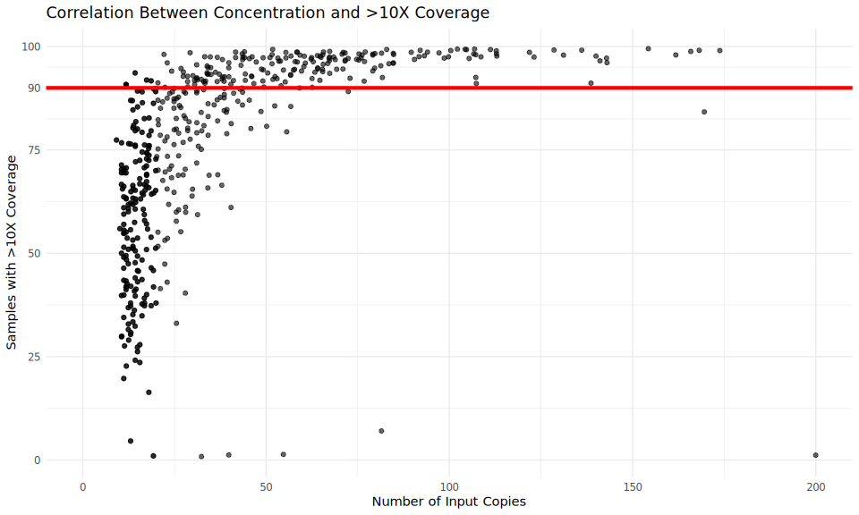
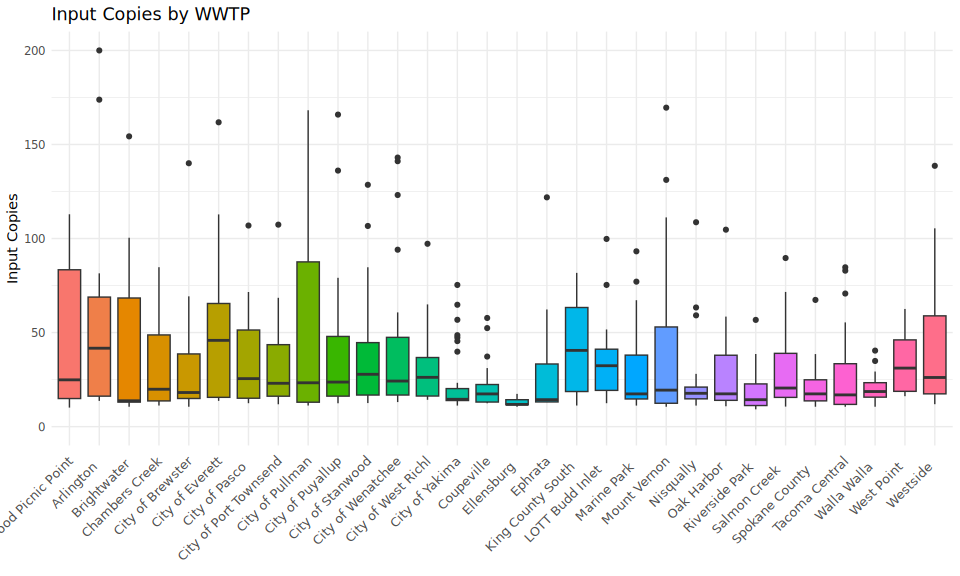
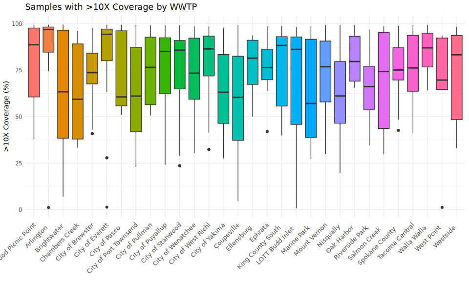
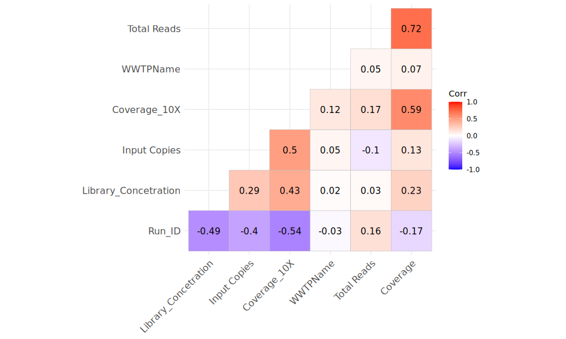
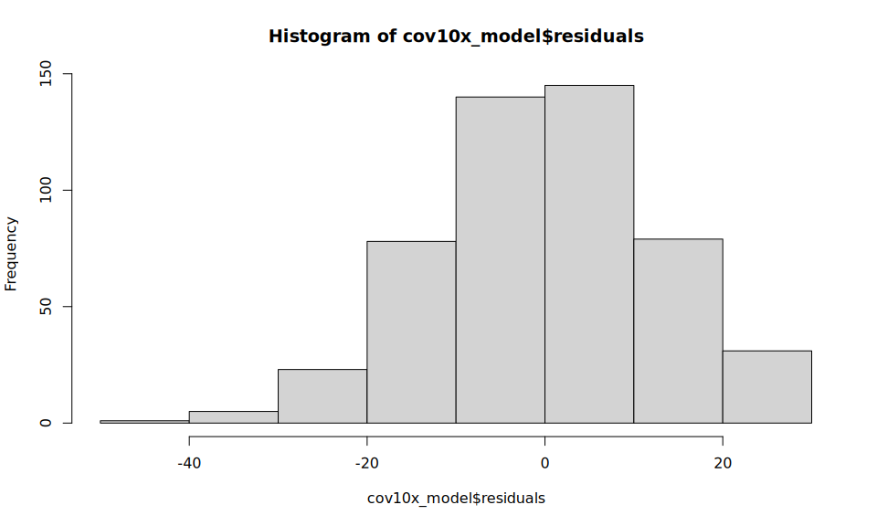

WWTP WGS Run Quality Analysis
================
WA DOH Advanced Molecular Detection Lab
2026-05-28

------------------------------------------------------------------------

## 1. Load Libraries

``` r
library(readxl)
library(dplyr)
library(ggplot2)
library(tidyr)
library(DBI)
library(odbc)
library(keyring)
library(purrr)
library(writexl)
```

------------------------------------------------------------------------

## 2. Connect to LIMS and Pull Data

``` r
con <- dbConnect(
  odbc(),
  Driver                = "ODBC Driver 18 for SQL Server",
  Server                = "DOH01DBTUMP22,9799",
  Database              = "LIMS_DATA",
  TrustServerCertificate = "Yes",
  Trusted_Connection    = "Yes"
)

lims_data <- dbGetQuery(
  con,
  "SELECT * FROM [vz_Epi_ELS_Multiplex_SARS-Flu-RSV-Mpox_dPCR]"
)
```

------------------------------------------------------------------------

## 3. Import and Combine Run Stats Excel File

``` r
# Set file path (update as needed)
file_path <- "/mnt/c/Users/qxy0303/scratch/WAWBE_outcome_analysis/Run Stats.xlsx"

# Read all sheets and append with sheet name as IC_Group
sheets <- excel_sheets(file_path)

df <- lapply(sheets, function(sheet_name) {
  read_excel(file_path, sheet = sheet_name) %>%
    mutate(IC_Group = sheet_name)
}) %>%
  bind_rows()
```

------------------------------------------------------------------------

## 4. Clean and Merge Data

``` r
# Rename columns
colnames(df)[colnames(df) == "Key_ID"]        <- "PHLAccessionNumber"
colnames(df)[colnames(df) == ">10X Coverage"] <- "Coverage_10X"

# Merge WWTP names from LIMS
df <- merge(
  df,
  lims_data[, c("PHLAccessionNumber", "WWTPName")],
  by = "PHLAccessionNumber"
)

# Drop unneeded columns
df <- df %>%
  select(-all_of(c(
    "0x Coverage",
    "...10",
    "...11",
    "#A",
    "#B",
    "#A/B",
    "#C",
    "% Failed",
    "% PASS (A)",
    "% PASS (A/B)",
    "Column1",
    "Library Prep Input Copies"
  )))

# Remove all-NA rows and the validation table sheet
df <- df %>%
  filter(
    rowSums(is.na(.)) != ncol(.),
    IC_Group != "Val Table"
  )

# Duplicated rows after merging, remove dups by WA# - QY
df <- df[!duplicated(df), ]


glimpse(df)
```

    ## Rows: 683
    ## Columns: 10
    ## $ PHLAccessionNumber   <chr> "WA1065052", "WA1065053", "WA1065054", "WA1065061…
    ## $ `Input Copies`       <dbl> 67.366, 67.275, 41.691, 90.493, 64.155, 31.239, 2…
    ## $ Library_Concetration <dbl> 5.265, 4.434, 4.575, 4.261, 4.186, 8.978, 3.751, …
    ## $ Coverage_10X         <dbl> 93.52239, 96.60904, 97.34140, 96.88326, 94.59586,…
    ## $ `Total Reads`        <dbl> 836866, 971774, 1351420, 1121720, 1001682, 192077…
    ## $ Coverage             <dbl> 2011.810, 2360.900, 3482.700, 2762.220, 2595.610,…
    ## $ Run_ID               <dbl> 200, 200, 200, 200, 200, 201, 201, 201, 201, 201,…
    ## $ QCD                  <chr> "A", "A", "A", "A", "A", NA, NA, "A", NA, NA, "B"…
    ## $ IC_Group             <chr> "50-100", "50-100", "40-49", "50-100", "50-100", …
    ## $ WWTPName             <chr> "Mount Vernon WWTP", "Alderwood Picnic Point WWTP…

------------------------------------------------------------------------

## 5. Correlation: Input Copies vs. \>10X Coverage

``` r
cor_result <- cor.test(
  df$`Input Copies`,
  df$Coverage_10X,
  method = "pearson"
)

cor_result
```

    ## 
    ##  Pearson's product-moment correlation
    ## 
    ## data:  df$`Input Copies` and df$Coverage_10X
    ## t = 10.757, df = 675, p-value < 2.2e-16
    ## alternative hypothesis: true correlation is not equal to 0
    ## 95 percent confidence interval:
    ##  0.3163058 0.4450630
    ## sample estimates:
    ##       cor 
    ## 0.3825401

> **Pearson r = 0.383**, p = 5.13^{-25}

### Scatter Plot

``` r
ggplot(df, aes(x = `Input Copies`, y = Coverage_10X)) +
  geom_point(alpha = 0.6) +
  geom_hline(yintercept = 90, color = "red", linewidth = 1.5) +
  scale_x_continuous(limits = c(0, 200)) +
  scale_y_continuous(breaks = c(0, 25, 50, 75, 90, 100)) +
  labs(
    title = "Correlation Between Concentration and >10X Coverage",
    x     = "Number of Input Copies",
    y     = "Samples with >10X Coverage"
  ) +
  theme_minimal()
```

<!-- -->

------------------------------------------------------------------------

## 6. WWTP-Level Boxplots

``` r
# Shared label-cleaning function for WWTP names
clean_wwtp <- function(x) {
  gsub(
    "WWTP|Water|Reclamation|Facility|Treatment|Plant|Wastewater|WRP|Clean|\\(SCTP\\)|Influent|Regional|and|Sewage",
    "", x
  )
}
```

### Input Copies by WWTP

``` r
ggplot(df, aes(x = WWTPName, y = `Input Copies`, fill = WWTPName)) +
  geom_boxplot() +
  scale_y_continuous(limits = c(0, 200)) +
  scale_x_discrete(labels = clean_wwtp) +
  labs(title = "Input Copies by WWTP", x = NULL, y = "Input Copies") +
  theme_minimal() +
  theme(
    axis.text.x  = element_text(angle = 45, hjust = 1, size = 10),
    legend.position = "none"
  )
```

<!-- -->

### Samples with \>10X Coverage by WWTP

``` r
ggplot(df, aes(x = WWTPName, y = Coverage_10X, fill = WWTPName)) +
  geom_boxplot() +
  scale_x_discrete(labels = clean_wwtp) +
  labs(title = "Samples with >10X Coverage by WWTP", x = NULL, y = ">10X Coverage (%)") +
  theme_minimal() +
  theme(
    axis.text.x  = element_text(angle = 45, hjust = 1, size = 10),
    legend.position = "none"
  )
```

<!-- -->

------------------------------------------------------------------------

## 7. Quality Summary Table by WWTP


``` r
quality_summary <- df %>%
  mutate(
    Quality = case_when(
      Coverage_10X >= 90                          ~ "A",
      Coverage_10X >= 60 & Coverage_10X < 90      ~ "B",
      Coverage_10X < 60                           ~ "Fail",
      TRUE                                        ~ NA_character_
    )
  ) %>%
  group_by(WWTPName) %>%
  summarise(
    Total_Samples    = n(),
    Percent_A        = round(mean(Quality == "A",    na.rm = TRUE) * 100, 1),
    Percent_B        = round(mean(Quality == "B",    na.rm = TRUE) * 100, 1),
    Percent_Fail     = round(mean(Quality == "Fail", na.rm = TRUE) * 100, 1),
    Avg_Input_Copies = round(mean(`Input Copies`,    na.rm = TRUE), 2)
  ) %>%
  arrange(desc(Percent_A))

quality_summary
```

    ## # A tibble: 30 × 6
    ##    WWTPName      Total_Samples Percent_A Percent_B Percent_Fail Avg_Input_Copies
    ##    <chr>                 <int>     <dbl>     <dbl>        <dbl>            <dbl>
    ##  1 City of Ever…            22      59.1      27.3         13.6             79.7
    ##  2 Arlington Wa…            19      57.9      36.8          5.3             87.0
    ##  3 Ellensburg W…            16      50        37.5         12.5             12.9
    ##  4 King County …            16      50        18.8         31.2             40.0
    ##  5 Alderwood Pi…            23      47.8      26.1         26.1             48.3
    ##  6 City of West…            12      41.7      33.3         25               33.6
    ##  7 Walla Walla …            17      41.2      58.8          0               39.7
    ##  8 City of Pasc…            15      40        20           40               35.3
    ##  9 Westside Sew…            27      37        33.3         29.6             40.3
    ## 10 Tacoma Centr…            19      36.8      42.1         21.1             30  
    ## # ℹ 20 more rows

``` r
# Export (run manually as needed)
write.csv(quality_summary, file = "WWTP_by_Sample_Quality.csv", row.names = FALSE)
write_xlsx(quality_summary, "quality_summary.xlsx")
```

------------------------------------------------------------------------

## 8. IC Group × QCD Pivot Table

``` r
df2 <- df %>%
  filter(!is.na(QCD)) %>%
  mutate(
    IC_Group = case_when(
      `Input Copies` >= 0   & `Input Copies` <= 4.9    ~ "IC 0-4",
      `Input Copies` >= 5   & `Input Copies` <= 9.9    ~ "IC 5-9",
      `Input Copies` >= 10  & `Input Copies` <= 19.9   ~ "IC 10-19",
      `Input Copies` >= 20  & `Input Copies` <= 29.9   ~ "IC 20-29",
      `Input Copies` >= 30  & `Input Copies` <= 39.9   ~ "IC 30-39",
      `Input Copies` >= 40  & `Input Copies` <= 49.9   ~ "IC 40-49",
      `Input Copies` >= 50  & `Input Copies` <= 100.9  ~ "IC 50-100",
      `Input Copies` >= 101 & `Input Copies` <= 1000   ~ "IC 101-1000",
      TRUE                                             ~ "Other"
    )
  )

IC_Group_Table <- df2 %>%
  group_by(WWTPName, IC_Group, QCD) %>%
  summarise(n = n(), .groups = "drop") %>%
  pivot_wider(
    names_from  = c(IC_Group, QCD),
    values_from = n,
    values_fill = 0
  )

IC_Group_Table
```

    ## # A tibble: 30 × 15
    ##    WWTPName `IC 10-19_B` `IC 10-19_C` `IC 101-1000_A` `IC 40-49_A` `IC 50-100_A`
    ##    <chr>           <int>        <int>           <int>        <int>         <int>
    ##  1 Alderwo…            2            2               4            1             6
    ##  2 Arlingt…            3            0               3            1             6
    ##  3 Brightw…            2            5               1            1             6
    ##  4 Chamber…            1            5               0            1             4
    ##  5 City of…            3            2               1            0             1
    ##  6 City of…            2            1               3            1             7
    ##  7 City of…            1            2               1            0             4
    ##  8 City of…            1            4               1            1             3
    ##  9 City of…            1            2               4            0             0
    ## 10 City of…            5            1               2            2             3
    ## # ℹ 20 more rows
    ## # ℹ 9 more variables: Other_C <int>, `IC 101-1000_C` <int>,
    ## #   `IC 50-100_C` <int>, `IC 50-100_B` <int>, `IC 40-49_B` <int>,
    ## #   Other_B <int>, `IC 10-19_A` <int>, `IC 101-1000_B` <int>, `IC 5-9_B` <int>

``` r
# Export (run manually as needed)
write.csv(df2, "WWTP_QCD_Data_2.csv", row.names = FALSE)
```

## 9. Multiple Linear Regression

``` r
library(ggcorrplot)

# Convert categorical data to numeric
df$WWTPName <- as.numeric(as.factor(df$WWTPName))

# Focus on only sample with low input copies
reduced_data <- subset(df, `Input Copies`<=40)

# Remove the irrelevant columns
reduced_data <- subset(reduced_data, select = -c( PHLAccessionNumber, QCD, IC_Group))

# Compute correlation between variables
corr_matrix = cor(reduced_data, use = "pairwise.complete.obs")

# Compute and show the  result
ggcorrplot(corr_matrix, hc.order = TRUE, type = "lower", lab = TRUE)
```

<!-- -->

Refine model by removing inter-correlating variables, then construct the
linear model

``` r
# Fit a multiple linear regression model
cov10x_model = lm(formula = Coverage_10X ~ 
                    `Input Copies` + 
                    Library_Concetration + 
                    `Total Reads` + 
                    Coverage + 
                    WWTPName,
                  data = reduced_data)

# Plot the model residuals to ensure normality of residual distribution
hist(cov10x_model$residuals)
```

<!-- -->

``` r
summary(cov10x_model)
```

    ## 
    ## Call:
    ## lm(formula = Coverage_10X ~ `Input Copies` + Library_Concetration + 
    ##     `Total Reads` + Coverage + WWTPName, data = reduced_data)
    ## 
    ## Residuals:
    ##     Min      1Q  Median      3Q     Max 
    ## -45.504  -8.149   0.276   7.925  29.786 
    ## 
    ## Coefficients:
    ##                        Estimate Std. Error t value Pr(>|t|)    
    ## (Intercept)           2.883e+01  2.330e+00  12.372  < 2e-16 ***
    ## `Input Copies`        8.232e-01  8.122e-02  10.135  < 2e-16 ***
    ## Library_Concetration  1.848e+00  3.329e-01   5.550 4.67e-08 ***
    ## `Total Reads`        -1.053e-05  1.250e-06  -8.424 3.96e-16 ***
    ## Coverage              1.058e-02  6.034e-04  17.538  < 2e-16 ***
    ## WWTPName              1.516e-01  6.930e-02   2.187   0.0292 *  
    ## ---
    ## Signif. codes:  0 '***' 0.001 '**' 0.01 '*' 0.05 '.' 0.1 ' ' 1
    ## 
    ## Residual standard error: 12.92 on 496 degrees of freedom
    ##   (4 observations deleted due to missingness)
    ## Multiple R-squared:  0.6176, Adjusted R-squared:  0.6138 
    ## F-statistic: 160.2 on 5 and 496 DF,  p-value: < 2.2e-16
